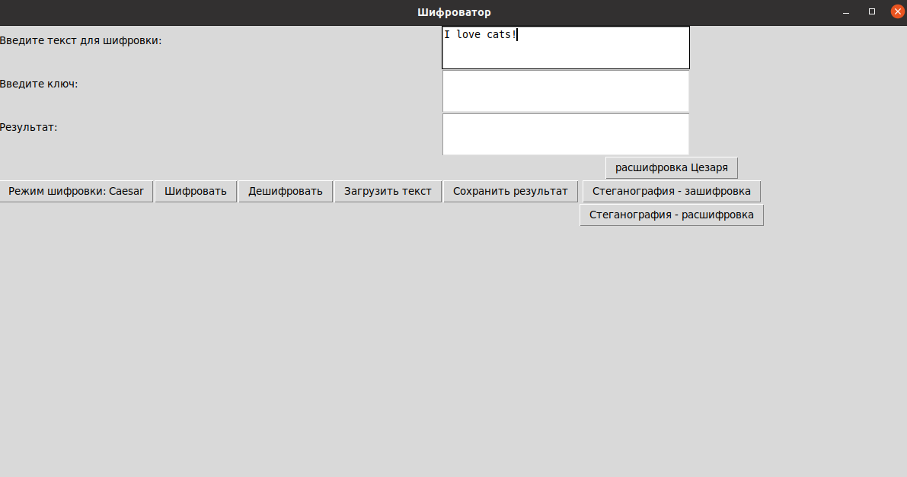
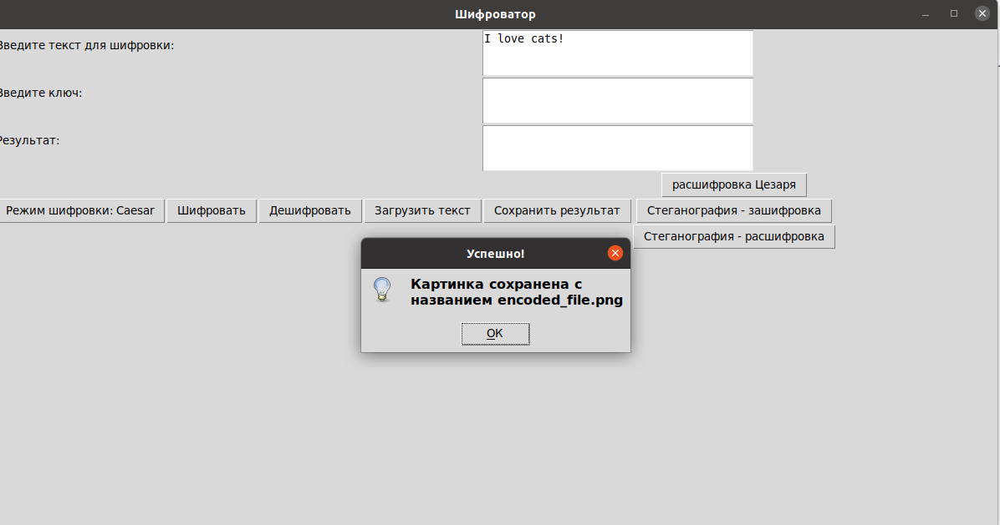
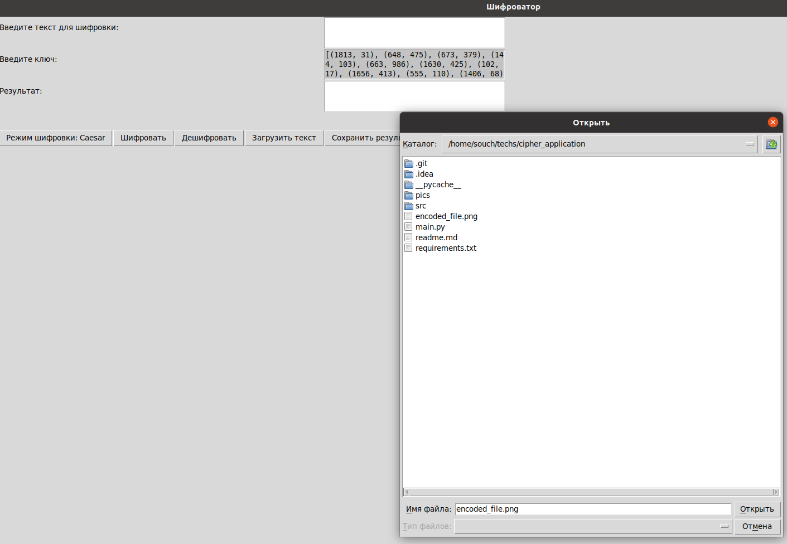
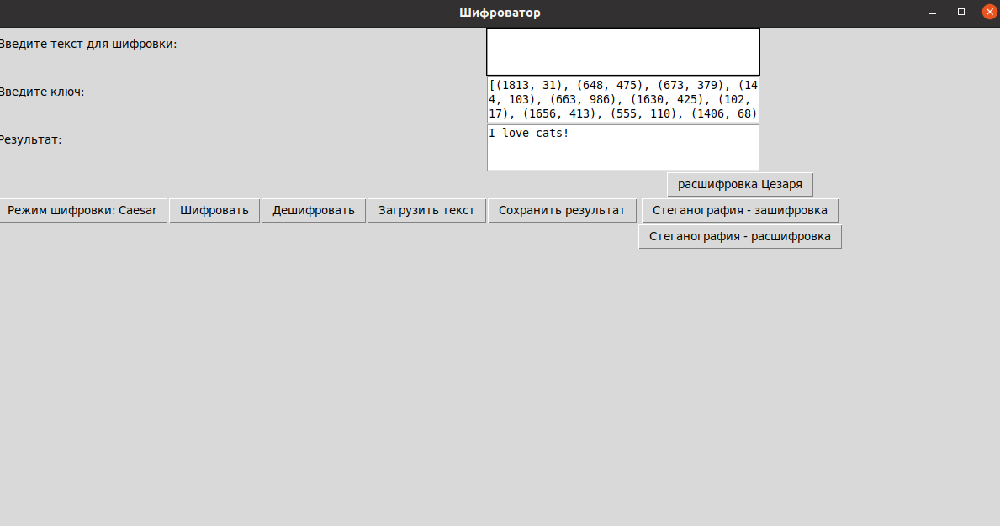

Шифроватор
---
Шифроватор - приложение, которое шифрует текст. Поддерживаются шифр Цезаря, Вернама, Виженера и стеганография.

---
Как запустить?
---
```angular2html
git clone https://github.com/teserk/cipher-application.git
cd cipher_application
pip install -r requirements
python3 main.py
```
---
Примеры работы
---
<b>Стеганография </b>

1. Пишем в текст то что хотим зашифровать в сообщение

2. Загружаем фотографию и видим это

3. Загружаем ключи в поле *Введите ключ:* и загружаем наше изображение

4. Получаем результат!

